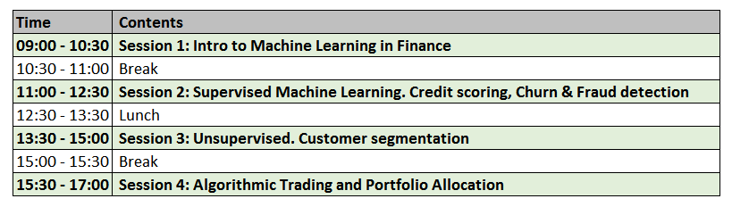

# Machine Learning in Finance (NYP)

[Skillsfuture url](https://eservices.nyp.edu.sg/alls/course/cseDetails.jsp?id=8983)

## SkillsFuture Course Description:

About the Course: This course aims to provide participants with an introduction to machine learning and data science. Examples of how it is applied to the world of finance will also be shared and discussed.

Target Participants: Finance Executives and Managers seeking to deepen or broaden their skills in this area.

[Course Brochure](https://eservices.nyp.edu.sg/attachments/alls/CB1038_165110.pdf)

## Course Description:

Interested to discover how Artificial Intelligence can be applied to the field of banking and finance?

* Keen to discover how to utilise Machine Learning to detect fraud, perform customer segmentations, credit scoring?

* Join us for this hands-on practical #Python course on Machine Learning for Finance!

## Course Structure

## Contents:
1. [Getting Started](https://nbviewer.jupyter.org/github/anthonyng2/ml_finance_nyp/blob/master/ML_Finance_2019/Lesson%201%20-%20Getting%20Started.ipynb)
2. [Data Preprocessing](https://nbviewer.jupyter.org/github/anthonyng2/ml_finance_nyp/blob/master/ML_Finance_2019/Lesson%202%20-%20Data%20Preprocessing.ipynb)
3. [Scikit-Learn API](https://nbviewer.jupyter.org/github/anthonyng2/ml_finance_nyp/blob/master/ML_Finance_2019/Lesson%203%20-%20Scikit%20Learn%20API.ipynb)
4. [Exploratory Data Anaysis (EDA)](https://nbviewer.jupyter.org/github/anthonyng2/ml_finance_nyp/blob/master/ML_Finance_2019/Lesson%204%20-%20EDA.ipynb)
5. [Linear Regression (Scikit-Learn)](https://nbviewer.jupyter.org/github/anthonyng2/ml_finance_nyp/blob/master/ML_Finance_2019/Lesson%205%20-%20Linear%20Regression.ipynb)
6. [Variance - Bias Tradeoff](https://nbviewer.jupyter.org/github/anthonyng2/ml_finance_nyp/blob/master/ML_Finance_2019/Lesson%206%20-%20Variance-Bias%20Trade%20Off.ipynb)
7. [Cross Validation](https://nbviewer.jupyter.org/github/anthonyng2/ml_finance_nyp/blob/master/ML_Finance_2019/Lesson%207%20-%20Cross%20Validation.ipynb)
8. [Classification](https://nbviewer.jupyter.org/github/anthonyng2/ml_finance_nyp/blob/master/ML_Finance_2019/Lesson%208%20-%20Classification%20%28Logistic%20Regression%29.ipynb)
9. [Classification Based Machine Learning Algorithm](https://nbviewer.jupyter.org/github/anthonyng2/ml_finance_nyp/blob/master/ML_Finance_2019/Lesson%209%20-%20Classification.ipynb)
10. [Unsupervised Learning: Clustering](https://nbviewer.jupyter.org/github/anthonyng2/ml_finance_nyp/blob/master/ML_Finance_2019/Lesson%2010%20-%20Clustering.ipynb)

